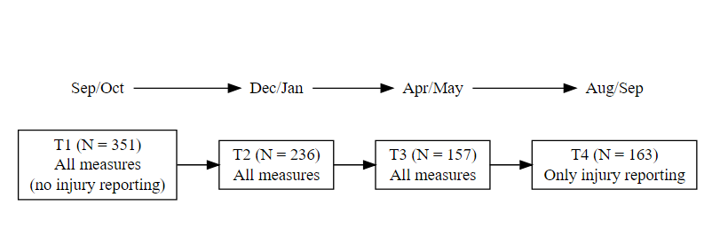
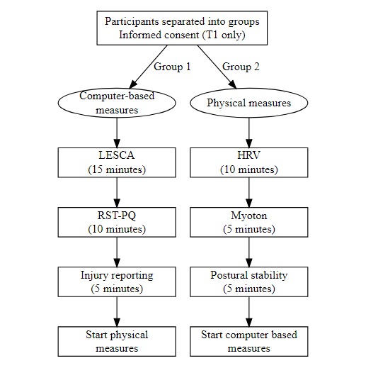
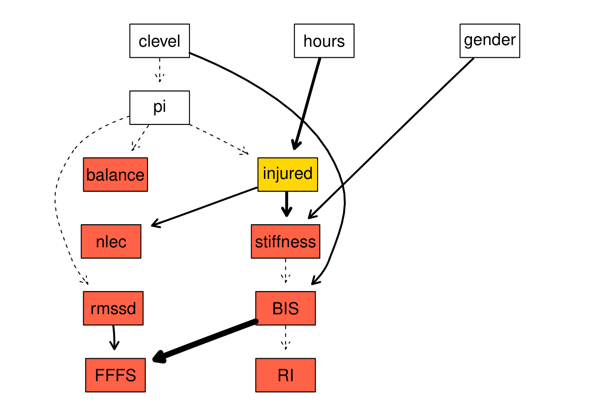

```{r echo=FALSE, include=FALSE}
library(Rgraphviz)
library(knitr)
library(tidyverse)
library(papaja)
library(RHRV)
library(kableExtra)
load("allfiles.Rdata")
knitr::opts_chunk$set(echo = FALSE)


```

<div style="line-height: 2em;"> 

This document provides a brief summary of the first study from my Ph.D., with a focus on the analysis and results.

# Study background

__Title: An interdisciplinary examination of stress-related factors and injury occurrence in athletes.__

Sports injury remains a problem and carries several undesirable consequences for the athlete. Research has typically address sports injury from a mono-disciplinary perspective, with the respective fields in sport science (e.g., Psychological, Biomechanical and Physiological perspectives) identifying risk factors in an isolated fashion.
Recently, there have been calls for sports injury research to move to a more complex systems based approach, where the interactions between a range of risk factors from different disciplines interact.
As such, the goal of my Ph.D was to identify related measures of stress and perform an appropriate analysis to evaluate their relationship with injury occurrence in athletes. 

# Method

In total, five variables were identified from the literature.

- Life event stress (Life event survey for collegiate athletes; LESCA)
- Personality characteristics (Reinforcement sensitivity questionnaire; RST-PQ)
- Muscle stiffness (Using novel handheld device MyotonPRO )
- Heart rate variability (Collect with Polar heart rate monitor and analysed using the RHVR package)
- Postural stability (Assessed using the Balance error scoring Systems; BESS)

These variables were found to relate to injury occurrence, but also to each other. For example, high life event stress is known to have an effect on muscle tension and heart rate variability.

A total of 351 athlete were initially recruited to take part in a prospective, repeated measures designed study. There were a total of four data collection sessions over a period of 12 months (figure \@ref(fig:design))

```{r design, fig.cap="Study design.", out.width='80%', fig.align='center'}

```

Figure \@ref(fig:protocol) shows how each of the measures were collected during each data collection session.

```{r protocol, fig.cap ="Procotol for data collection.", out.width='60%', fig.align='center'}

```


# Analysis and Results

Several considerations were made regarding the analysis before finally choosing Bayesian networks (See [here](https://htmlpreview.github.io/?https://github.com/HarryFisher1/Data-analysis/blob/master/Analysisexamples.html) for a discussion of the methods I considered).

Bayesian Network were chosen as they provide a graphical representation of a joint probability distribution among a set of random variables, and describe the dependencies and conditional independences from empirical data in a visually appealing way. 
Formally, a BN is directed acyclic graph (DAG) containing arcs and nodes, where arcs _between_ nodes represent dependence between variables.
To obtain the final structure, variables were first binarised in "Low" and "High" categories, as is common in Bayesian network modelling. 
The final network structured was obtained by averaging 1000 bootstrapped models to reduce the impact of locally optimal, but globally suboptimal network learning, and to obtain a more robust model.
Arcs that were present in at least 30% of the models were included in the averaged model.

Bayesian Network were fitted using the bnlearn package in R


## Main network 

Figure \@ref(fig:networkstructure) shows the main network structure. To account for the repeated measurements in the data, a two time Bayesian network (T2BN) was used where future time points could be dependent on previous time points, but not the other way round. Explanatory variable are shown in white, variables of interest are shown in red, and the dependent variable, "injured", is shown in gold (a description of the variables is provided in a table at the end of this document).

```{r networkstructure, fig.align='default', fig.height=8, fig.width=12, fig.cap=' The full Bayesian network structure was plotted using the _strength.plot_ function in bnlearn. The strength of each arc is shown graphically by the style of the arc. Thin, dashed arcs indicate the weakest arcs (arc strength below 0.50), whereas thick solid arcs indicate the strongest arcs (arc strength of 1). White nodes in the network indicate the explanatory variables, blue nodes indicate T1_1 and T2_1 variables, and red nodes indicated T2_2 and T3_2 variables. The injured_X nodes have been coloured gold as they are the main nodes of interest within the network.'}
renderGraph(gR)
```


## 


As injury was the main node of interest, the Markov blankets (simply all the variables that are directly connect to an injured node) of both injury nodes were further investigated. 
These smaller networks also show the strength of the arcs (on a scale between 0 and 1, with 1 being the strongest possible arc).

```{r out.width="50%"}
include_graphics(c("./figures/node1-1.png", "./figures/mb2-1.png")) 
```


Using these networks it was possible to perform queries to identify the factors that contributed to the highest probability of injury. 
For example, table \@ref(tab:query1) shows an example from the first Markov blanket (only the top and bottom three combinations are shown). 
The combination of being a university level athlete, who had "High" training hours "Low" life event stress, "High" muscle stiffness and poor balance had over 50% probability of sustaining an injury.
In contrast, and athlete with "Low" for all variables had only 0.04% chance of injury.


```{r query1}
query2 %>% 
  select(7,2:6) %>% 
  rename(Probability = "prob") %>% 
  kable(caption = "Highest and lowest probability of injured_1 being in the 'injured' state, conditional on the all variables in the Markov blanket for injured_1.",
            align = c("cccccc")) %>% 
  pack_rows("Highest", 1,3) %>% 
  pack_rows("Lowest", 4, 6) %>% 
  kable_styling(bootstrap_options = "striped")

```


## Second network - modelling changes

To explicitly model the amount of change that occurred between time points, a second network was investigated (figure \@ref(fig:secondnetwork)). This network used differential questions to investigate how the amount of change between variables was related to injury occurrence.

```{r secondnetwork, fig.cap="Second network used to model changes between time points in the study", fig.align='center'}

```
For this network, variables were held at the mean change as well as 1SD below and 1SD above the mean change. 
The combination of changes in negative life events and muscle stiffness resulted in the greatest probability of injury (table \@ref(tab:query2))

```{r query2}
query6 %>% 
  select(nle, stiffness, prob) %>% 
  mutate_at(vars(nle, stiffness), ~case_when(. == 1 ~ "+1SD",
                                             . == 0 ~ "mean",
                                             . == -1 ~ "-1SD")) %>% 
  arrange(-prob) %>% 
  mutate(prob = round(prob, digits = 2)) %>% 
  select(c(3,1,2)) %>% 
  kable(align = c("ccc"),
            col.names = c("Probability of injury","nlec", "Stiffness"),
            caption = "The probability of injury with values of stiffness and nlec held at 1SD below the mean change, at the mean change and 1SD above the mean change",
        booktabs = T) %>% 
  kable_styling(bootstrap_options = "striped")
```


# Conclusion

This study provided a novel approach to addressing the sport injury problem from a holistic perspective. 


```{r}
my_citations <- cite_r(file = "r_references.bib")
```


## R Packages used

`r my_citations`


# References

<div id="refs"></div>

# (APPENDIX) Appendix {-} 

# Variables with explanation

```{r results='asis'}
varcutoffs %>% 
  filter(!var %in% c("sdnn", "RR", "I", "GDP", "tlelg", "tlelg_1", "tlelg_2", "tlelg_3", "bal_asym")
) %>% 
  kable(booktabs = T,
       align = c("llcc"),
       caption = "Variables included in the final network structure",
       col.names = c("Variable", "Definition", "State 1", "State 2")) %>%
  kable_styling() %>% 
  column_spec(2, width = c("8cm")) 
```


 </div>

